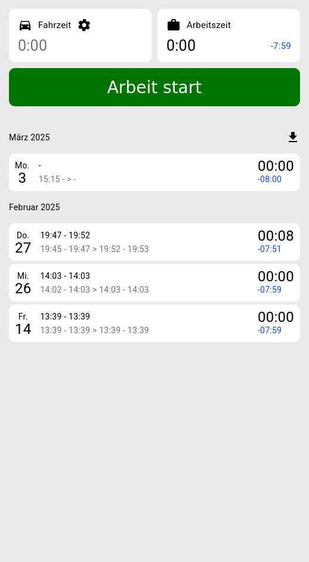

# WorkTimes

Diese App stellt eine einfache Benutzeroberfläche zum Tracken von Fahrtwegen und Arbeitszeiten da.
Diese ist Online unter [https://orangenkuchen.github.io/WorkTimes/](https://orangenkuchen.github.io/WorkTimes/).

Die primäre Motivation dieser App war es, Index-DB und ServiceWorker zu lernen.

## Features

- Reisezeit erfassen
- Arbeitszeit erfassen
- Vergange Zeiten darstellen
- Export als CSV
- Komplett offline fähig
- Dark Mode (automatisch)

## Entwicklung

Nach dem initialen Checkout müss die NPM-Packete mit `npm i` installiert werden.
Das Projekt verwendet Angular und kann mit `ng serve` debugged werden.

Zum debuggen vom ServiceWorker reicht der interne Angular-Development-Server nicht aus (da ServiceWorker nicht korrekt gehandelt werden).
Um diesen zu debuggen kann folgender Befehl verwendet werden `ng build; npx http-server -p 8080 -c-1 dist/work-times/browser`.

Zum deployen auf Github.io kann folgender Befehl verwendet werden `ng deploy --base-href=./WorkTimes;`;